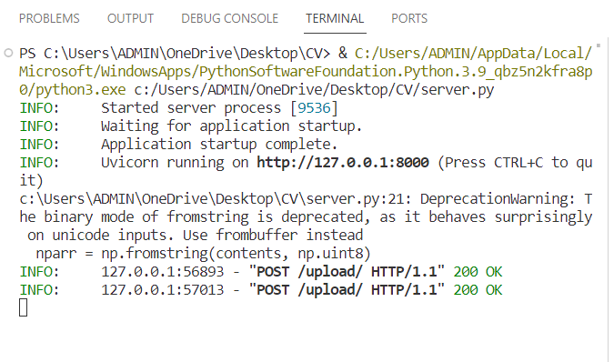
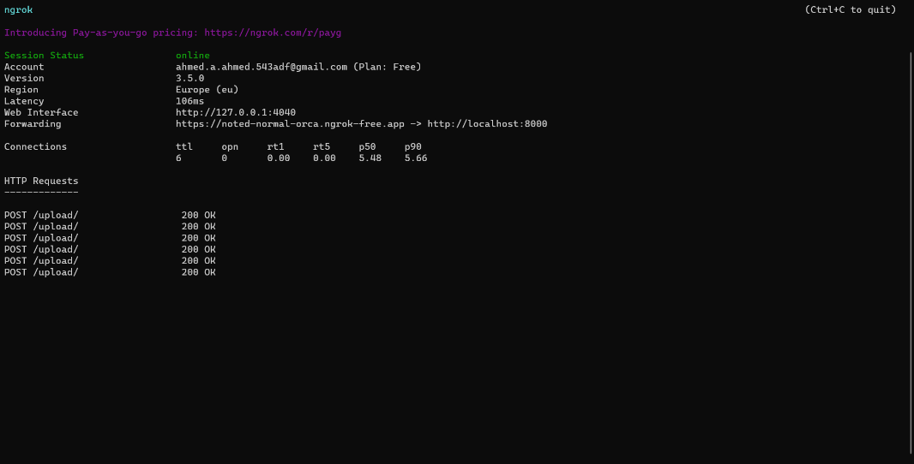

**CSE429**

**Computer vision and pattern recognition**

**Final Project Documentation**

Group Members:\
Ahmed Abdelkader Ahmed -- 120200028

 / Mahmoud Akrm Mohamed -- 120200045

 / Mohamed Ayman Mohamed -- 120200081

 / Peter Fayez Shafiq -- 120200073

 / Ziad Hesham Al-Safy -- 120200078

 / Ahmad Mongy Saad -- 120200033

**To:**

DR. Ahmed Saleh

Eng. Mahmoud Sharshira

-   # Overview:

Welcome to the documentation for the Face Recognition and Attendance
System project. This application is a mobile-based Application developed
using face_recognition (Python), and Kotlin .The Face Recognition and
Attendance System is an innovative application that combines the power
of face recognition technology, Firebase authentication, and a
user-friendly graphical interface. This project is designed to
streamline the process of taking attendance by utilizing facial features
for recognition.

-   # Key Features:

1.  ### **Login and Signup:**

    -   Users can securely log in or sign up using their email and
        password through Firebase authentication.

2.  ### **Course and Week Selection:**

    -   After authentication, users can select the course and week for
        which they want to mark attendance.

3.  ### **Face Recognition:**

    -   The heart of the system lies in its face recognition
        capabilities. Users can upload an image, and the system will
        recognize faces, linking them to registered individuals.

4.  ### **Attendance Recording:**

    -   The recognized faces are then used to mark attendance for the
        selected course and week. The attendance data is stored securely
        on Firebase Realtime Database.

5.  ### **Dynamic GUI:**

    -   The Graphical User Interface (GUI) is dynamic, adapting to
        different stages of the attendance process. It provides a smooth
        and intuitive user experience.

6.  ### **Firebase Integration:**

    -   Firebase is utilized for user authentication and as a backend
        for storing attendance data. This ensures data security and
        accessibility from anywhere.

7.  ### **WEB Deploying using NGrok:**

### 

-   # Technologies Used:

1.  ### **Programming Language**: 

    -   Python, Kotlin

2.  ### **Libraries and Frameworks:**

    -   Tkinter

    -   Pyrebase

    -   Firebase Admin SDK

    -   FastAPI

    -   AndroidX Navigation (2.7.5)

    -   Kotlin Coroutines (1.3.9)

    -   Firebase BOM (32.7.0)

    -   OkHttp (4.9.1)

    -   AndroidX Core (1.12.0)

    -   AndroidX AppCompat (1.6.1)

    -   Material Design Library (1.11.0)

    -   ConstraintLayout (2.1.4)

    -   Firebase Authentication

    -   Google Play Services Authentication (20.7.0)

    -   Firebase Realtime Database

    -   Firebase Realtime Database (KTX, 20.3.0)

3.  ### **Database:**

    -   Firebase Realtime Database

4.  ### **Web Framework:** 

    -   FastAPI

5.  ### **Image Processing:** 

    -   OpenCV, Pillow, face_recognition

6.  ### **Android Development Dependencies:**

> implementation \"androidx.navigation:navigation-fragment-ktx:2.7.5\"
>
> implementation \"androidx.navigation:navigation-ui-ktx:2.7.5\"
>
> implementation
> \"org.jetbrains.kotlinx:kotlinx-coroutines-android:1.3.9\"
>
> implementation platform(\"com.google.firebase:firebase-bom:32.7.0\")
>
> implementation \"com.squareup.okhttp3:okhttp:4.9.1\"
>
> implementation \"androidx.core:core-ktx:1.12.0\"
>
> implementation \"androidx.appcompat:appcompat:1.6.1\"
>
> implementation \"com.google.android.material:material:1.11.0\"
>
> implementation \"androidx.constraintlayout:constraintlayout:2.1.4\"
>
> implementation \"com.google.firebase:firebase-auth\"
>
> implementation \"com.google.android.gms:play-services-auth:20.7.0\"
>
> implementation \"com.google.firebase:firebase-database\"
>
> implementation\"com.google.firebase:firebase-database**-ktx:20.3.0\"\
> **

-   # How to Use:

1.  ### **Login or Signup:**

    -   Users start by logging in or creating an account through the
        secure Firebase authentication system.

2.  ### **Course and Week Selection:**

    -   After authentication, users choose the course and week for which
        they want to mark attendance.

3.  ### **Face Recognition:**

    -   Users upload an image containing faces. The system recognizes
        faces and displays the recognized names.

4.  ### **Attendance Recording:**

    -   Recognized names are used to mark attendance for the selected
        course and week, and the data is stored in Firebase.

-   # Benefits:

1.  ### **Efficiency:**

    -   Streamlines attendance marking, reducing the time and effort
        required in traditional methods.

2.  ### **Accuracy:**

    -   Face recognition **ensures accurate and reliable attendance
        recording.**

3.  ### **Accessibility:**

    -   Firebase integration allows access to attendance data from
        anywhere, promoting remote management.

    -   **User-Friendly:**

    -   The intuitive GUI makes the system user-friendly, catering to
        users with varying technical expertise.

-   # Project structure 

## ADD_Faces.py

1.  ### **read_random_frames function:**

    -   Purpose:

> Reads a specified number of random frames from a video file.

-   Parameters:

> video_path: Path to the input video file.
>
> num_frames_to_read: Number of frames to read from the video.

-   Output:

> Saves the randomly selected frames as individual image files in the
> \"images\" directory.

2.  ### **create_images_AND_names function:**

    -   Purpose:

> Reads images from the \"images\" directory and extracts names from
> file names.

-   Output:

> Two lists: images (containing images) and names (containing
> corresponding names).

3.  ### **findEncodings function:**

    -   Purpose:

> Converts images to RGB format and finds face encodings using the
> face_recognition library.

-   Parameters:

> images: List of images.

-   Output:

> List of face encodings.

4.  ### **creatpik function:**

    -   Purpose:

> Creates and saves a Pickle file containing face encodings and
> corresponding names.

-   Output:

> Saves the Pickle file named \"EncodeFile.pkl\".

5.  ### **update_pickle function:**

    -   Purpose:

> Updates an existing Pickle file with new face encodings and names.

-   Output:

> Saves the updated Pickle file.

6.  ### **main function:**

    -   Purpose:

> The heart of the file as it , iterates through a directory of videos,
> reads random frames, and updates the Pickle file.

## FastAPI Server Code

1.  ### **Importing Libraries and Modules**

2.  ### **FastAPI App Setup:**

3.  ### **Loading Encoded Data:**

    -   Reads the face encodings and corresponding names from the Pickle
        file.

4.  ### **Endpoint for Image Upload:**

    -   Defines a FastAPI endpoint for uploading images.

5.  ### **Image Processing and Face Recognition:**

    -   Reads the uploaded image, processes it for face recognition.

6.  ### **Face Matching and Result Compilation:**

    -   Compares the face encodings with the known encodings and appends
        the corresponding names to the result if a match is found.

7.  ### **Returning Result:**

    -   Returns the result (list of recognized names) as the response.

8.  ### **Running the FastAPI Server:**

    -   Runs the FastAPI server on http://127.0.0.1:8000/.

9.  ### **Additional Notes**

    -   Ensure the necessary libraries (fastapi, uvicorn,
        face_recognition, cv2, numpy) are installed before running the
        script.

    -   Add more comments if needed, especially for complex logic or
        important parts of the code.

    -   Consider adding exception handling to deal with potential errors
        during image processing or file reading.

## Firebase Authentication and Face Recognition GUI

1.  ### **Importing Libraries and Modules**

2.  ###  **Class: FirebaseAuthenticationApp**

-   Initialization**:**

    -   Initializes the GUI and sets up the initial configuration.

    -   Sets up the Firebase configuration using the provided
        credentials.

    -   Initializes Firebase authentication and required variables.

-   logincreate_widgets Method:

    -   Creates and displays login widgets.

    -   Entry fields for email and password, login and signup buttons.

-   pathcreate_widgets Method:

    -   Creates and displays widgets for selecting the course and week.

    -   Entry fields for course name and week number, save button.

-   FRcreate_widgets Method**:**

    -   Creates and displays widgets for face recognition.

    -   Image upload button, image display frame, recognition result
        display.

-   delete_widgets Method**:**

    -   Deletes all widgets in the GUI.

-   login Method**:**

    -   Attempts to log in the user with provided email and password.

    -   Handles successful login and errors.

-   signup Method**:**

    -   Attempts to sign up a new user with provided email and password.

    -   Prompts the user to log in after successful signup.

-   upload**\_**image Method**:**

    -   Allows the user to upload an image for recognition.

    -   Displays the selected image in the GUI.

-   recognize Method**:**

    -   Sends the uploaded image to the FastAPI server for recognition.

    -   Displays recognized people in the result text widget.

-   delete_image Method**:**

    -   Deletes the uploaded image and resets the image frame.

-   save_input Method:

    -   Saves the course name and week number from input fields.

    -   Resets the GUI for face recognition.

-   update_pickle Method:

    -   Updates the face recognition pickle file with a new person\'s
        face.

-   findEncodings Method:

    -   Finds face encodings for a given set of images.

### **Additional Notes:**

-   The code seems to use a custom Tkinter library (**customtkinter**)
    and **CTkMessagebox**. Ensure they are available or replace them
    with standard Tkinter elements if necessary.

-   Confirm that the Firebase configuration is accurate and secure.

-   Consider adding more detailed comments for complex or crucial parts
    of the code.

## Mobile APP 

### **Introduction**

> This document provides an overview of the Kotlin code implementation
> for the Attendance App developed in Android Studio. The app
> facilitates tracking attendance for classes and weeks, utilizing
> Firebase for data storage and retrieval.

### **Dependencies**

> The app relies on the following dependencies:

-   Kotlin

-   AndroidX

-   Firebase SDK

-   OkHttp

-   Data Binding

### **Firebase Integration**

> Firebase is used for real-time data storage and retrieval. Key
> references include:

-   database.reference: Reference to the root of the Firebase database.

-   auth: Firebase Authentication instance.

-   userRef, classRef, weekRef: References to specific locations in the
    > database based on user and class information.

### **UI Components**

-   FragmentAtendanceBinding: Data Binding object for the attendance
    > fragment.

-   FAB (Floating Action Button): Toggles camera and person icons for
    > user interaction.

-   RecyclerView: Displays a list of students using SectionsAdapter.

-   ProgressBar and TextView: Indicate loading state and provide user
    > feedback.

### **Camera Integration**

-   startActivityForResult: Launches the camera intent to capture
    > images.

-   onActivityResult: Handles the result of the camera activity and
    > processes the captured image.

### **HTTP POST Request**

-   postBitmapWithHeaderAsync: Sends a POST request with a Bitmap image
    > to a specified API endpoint.

-   Utilizes OkHttp for networking.

-   Custom header (\"ngrok-skip-browser-warning\") added for skipping
    > ngrok warning.

### **Image Handling**

-   saveImage: Saves a Bitmap image to the device\'s external storage.

-   Uses Environment.getExternalStoragePublicDirectory for storing
    > images.
